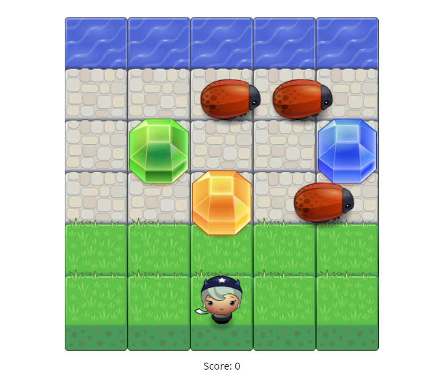

# Classic Arcade Game Clone

A simple arcade game using object oriented JavaScript.



## Getting Started

These instructions will get you a copy of the project up and running on your local machine to start playing.

### Dependencies

* [Google Fonts](https://fonts.google.com/)

### Installing

Clone with HTTPS

```
git clone https://github.com/costas90/classic-arcade-game-clone.git
```

or Download as a zip.

Then open ```index.html``` to open the game in your browser and start playing!

### How to Play

First choose a character and click the "Start Playing Now!" button.

Move the player with the arrow keys. The objective is to collect as high
of a score as possible. Your score increases by 10 points every time you
collect a gem or when you reach the water.

Stay away from the red bugs! If you touch them the game will be over.

## License

This project is licensed under the [MIT License](License.md).

### Acknowledgments

This project is part of the Frontend Nanodegree from Udacity.com.
